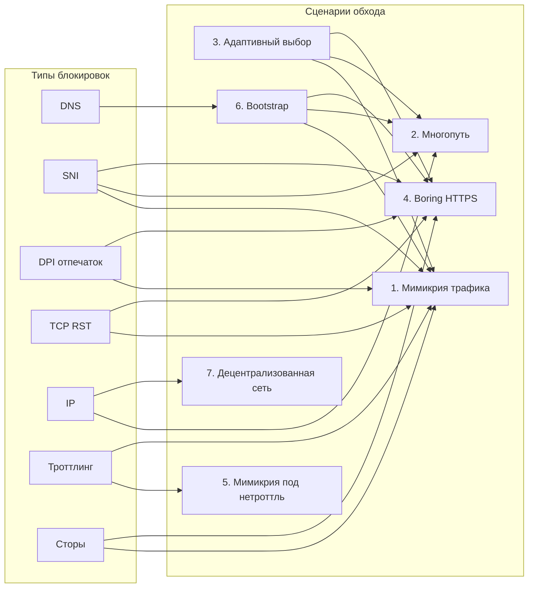

# Новые сценарии обхода блокировок для VPN-приложений

Документ описывает **новые** архитектурные и продуктовые сценарии работы VPN-приложений, рассчитанные на обход блокировок из [отчёта по блокировкам](BLOCKING_REPORT_WORLDWIDE.md). Технические детали блокировок см. там же.

**Использовать нельзя:** WireGuard, OpenVPN, IKEv2, Shadowsocks, VMess/VLESS (XRay), Tor, классический domain fronting, обфускация вида obfs4/meek — они уже известны и целенаправленно детектируются/блокируются (отпечатки протокола, блокировка ESNI, блокировка «подозрительного» шифрованного трафика).

---

## Сценарий 1: Трафик-мимикрия под легитимный сервис (Traffic Mimicry)

**Идея:** Туннель не имеет собственного отпечатка протокола. Весь исходящий трафик приложения **статистически и структурно похож** на трафик одного выбранного легитимного сервиса (крупный CDN, облачное хранилище, корпоративный мессенджер или видеоконференции), который в данной юрисдикции не блокируют и не троттлят.

**Против чего:** DPI по отпечатку протокола, троттлинг по типу трафика, частично SNI (если SNI = домен «прикрытия» и блокировать его невыгодно).

**Как достигается:**

- Один фиксированный домен в SNI (принадлежит крупному провайдеру; блокировка = массовый коллатеральный ущерб).
- TLS-отпечаток (JA3/JA4, порядок расширений, размеры записей) совпадает с выбранным «эталонным» приложением.
- Размеры пакетов и тайминги (bursts, паузы) имитируются под типичный паттерн этого сервиса (например, «как Zoom» или «как облачный диск»).
- Полезная нагрузка туннеля — внутри обычного HTTPS (тело запросов/ответов), без кастомного протокола поверх TLS.

**Рыночная позиция:** «Оптимизация корпоративного доступа», «стабильное подключение к облачным сервисам» — без формулировок про обход блокировок; при необходимости гео-ограничение функций по странам для соответствия правилам сторов.

---

## Сценарий 2: Многопутевой фрагментированный туннель (Multipath Fragment Tunnel)

**Идея:** Один логический туннель **разбит на множество независимых потоков** к разным хостам (разные домены или пути на CDN). Ни один отдельный поток не несёт полного отпечатка VPN; фрагменты собираются на стороне выхода.

**Против чего:** Идентификация по одному «подозрительному» зашифрованному потоку; блокировка по одному SNI/домену; эвристики «один длинный шифрованный поток = туннель».

**Как достигается:**

- Пул доменов: несколько «белых» доменов (разные CDN/облака), по одному соединению или запросу на домен.
- Фрагменты payload туннеля разносятся по разным соединениям; порядок и принадлежность — по внутреннему заголовку (зашиты в теле HTTPS).
- На уровне сети видны только множество обычных HTTPS-сессий к разным разрешённым доменам; размеры и тайминги можно приближать к типичным для браузера/CDN.

**Рыночная позиция:** «Распределённое резервное подключение», «мульти-путь для надёжности» — акцент на отказоустойчивость, не на обход.

---

## Сценарий 3: Адаптивный выбор стратегии по региону (Adaptive Strategy Selector)

**Идея:** Приложение **само определяет тип цензуры** в сети пользователя (только DNS; DNS + SNI; DPI с отпечатками; троттлинг по домену; блокировка ESNI) и **переключает режим работы** без явного выбора пользователя.

**Против чего:** Разные комбинации блокировок в разных странах (Россия vs Китай vs Иран vs Турция); единый «жёсткий» протокол везде легко добавляют в блок-лист.

**Как достигается:**

- При старте или периодически: тесты (доступность эталонных доменов, DoH/DoT, поведение при ESNI/без SNI, задержки до известных CDN).
- По результатам выбирается одна из внутренних стратегий: «только DoH + один домен», «мимикрия под сервис X», «многопутевой фрагмент», «резерв: только IP без SNI» и т.д.
- Пользователь видит одно «подключение»; под капотом меняется только способ установки туннеля и вид трафика.

**Рыночная позиция:** «Умное подключение», «автоматическая оптимизация под сеть» — без упоминания обхода цензуры; снижает необходимость ручной настройки и повышает живучесть в поездках.

---

## Сценарий 4: Единый «скучный» HTTPS-туннель (Boring HTTPS-Only Tunnel)

**Идея:** Нет кастомного протокола поверх TLS. Туннель — это **последовательность обычных HTTPS-запросов и ответов** к одному или нескольким доменам (например, API облачного хранилища или документ-сервиса). Полезные данные — в теле запросов/ответов (например, в base64/json в теле POST); серверная часть принадлежит оператору туннеля и интерпретирует их как сессию туннеля.

**Против чего:** Блокировка по отпечатку протокола (его нет), блокировка по SNI только если домен заблокируют (выбор «неблокируемого» домена), блокировка ESNI (не используем ESNI — обычный TLS с одним легитимным SNI).

**Как достигается:**

- Клиент ведёт себя как типичное приложение к облачному API: те же методы, заголовки, размеры запросов.
- Один домен в SNI, по возможности тот, что уже широко используется в регионе для бизнеса/образования.
- На стороне выхода — обратный прокси в интернет; для сети это просто «пользователь ходит в облачный сервис».

**Рыночная позиция:** «Безопасный доступ к корпоративному облаку», «приватный доступ к документам» — уход от позиционирования как «VPN для обхода блокировок»; проще проходить модерацию сторов.

---

## Сценарий 5: Мимикрия под нетроттлящий сервис (Throttling-Aware Mimicry)

**Идея:** В части стран троттлят конкретные сервисы (например, видеохостинг), но не другие (например, видеоконференции или корпоративные инструменты). Трафик туннеля **намеренно имитирует тот сервис, который в данной стране не замедляют**.

**Против чего:** Троттлинг по домену/приложению (п. 4.5 и 5.4 отчёта по блокировкам).

**Как достигается:**

- В приложении или с бэкенда загружается «карта троттлинга» по странам/сетям: какой тип трафика обычно не замедляют (домен, TLS fingerprint, паттерн запросов).
- Туннель генерирует трафик, неотличимый по этим признакам от нетроттлящего сервиса (те же размеры пакетов, периодичность, при необходимости — SNI и отпечаток под этот сервис).
- Комбинируется со сценарием 1 или 4: один «прикрывающий» сервис выбран так, чтобы и не блокировали, и не троттлили.

**Рыночная позиция:** «Стабильная скорость в поездках», «оптимизация для видеозвонков» — акцент на качество связи, не на обход.

---

## Сценарий 6: Bootstrap без единой точки отказа (Censorship-Resilient Bootstrap)

**Идея:** Получение конфигурации и адресов точек входа **не должно выглядеть как типичный VPN bootstrap** (один домен/IP, известный как «VPN», сразу в блок-листе). Цепочка fallback и «безопасные» источники данных.

**Против чего:** DNS-блокировка домена приложения/конфигов; IP-блокировка серверов управления; блокировка по SNI при первом же запросе к «подозрительному» домену.

**Как достигается:**

- Конфиг/список точек входа: сначала через DoH/DoT к публичным резолверам; при недоступности — запрос по HTTPS к доменам крупных CDN/облаков (вид «запрос к CDN», не к vpn.example).
- Резерв: зашитые в приложение IP и SNI «прикрытия» (легитимные сервисы), по которым приложение получает минимальный конфиг (например, один раз в версию приложения обновляемый список).
- Ни один этап не использует один и тот же известный «VPN-домен»; трафик на каждом шаге похож на обычный веб/CDN.

**Рыночная позиция:** Не отдельный продукт, а **обязательный компонент** любого из сценариев 1–5: приложение остаётся подключаемым даже при блокировке основного домена.

---

## Сценарий 7: Децентрализованная сеть релеев (Decentralized Relay Mesh)

**Идея:** Нет единого набора серверов провайдера, которые можно внести в реестр и заблокировать по IP. Пользователи в менее ограниченных сетях **добровольно отдают часть канала** как выход; трафик между клиентом и релеем **не похож на известные P2P-туннели** (не Tor, не BitTorrent).

**Против чего:** Блокировка по IP провайдера; блокировка по отпечатку протокола (Tor, VPN); централизованное давление на одного оператора.

**Как достигается:**

- Протокол обмена: только разрешённые в регионе форматы (например, HTTPS или WebSocket к обычным доменам). Участник-релей поднимает легитимный веб-сервис (или использует существующий), через который в теле запросов передаются зашифрованные сегменты.
- Поиск релеев: через DHT или каталог, но запросы к каталогу — тоже через «нормальный» HTTPS к доменам, не к одному «vpn-p2p.example».
- Трафик между пользователем и релеем виден как «пользователь общается с обычным сайтом/API»; между релеями при необходимости — то же.

**Рыночная позиция:** «Совместная сеть доступа», «community bandwidth sharing» — акцент на совместное использование ресурсов и отказоустойчивость; юридически и в сторах может оформляться как «экспериментальная функция».

---

## Сопоставление с типами блокировок

---

## Рекомендуемый порядок проработки

Порядок согласован с планом выполнения [VPN_BYPASS_EXECUTION_PLAN.md](VPN_BYPASS_EXECUTION_PLAN.md): сначала лаборатория (PoC и тесты без приложения), затем интеграция, затем тест в приложении.

1. **Сценарий 6 (Bootstrap)** — базовый элемент: без устойчивого получения конфига остальные сценарии теряют смысл при блокировке доменов приложения.
2. **Сценарий 4 (Boring HTTPS)** — минимальная реализация «нового» туннеля без кастомного протокола; проще валидировать на предмет обхода DPI/SNI.
3. **Сценарий 1 (Traffic Mimicry)** — усиление сценария 4 за счёт подстройки под конкретный легитимный сервис (TLS fingerprint, паттерны).
4. **Сценарий 3 (Adaptive Strategy)** — поверх выбранных реализаций 1/4/2: автоматическое определение среды и переключение режима.
5. **Сценарии 2, 5, 7** — следующие итерации (фрагментация, анти-троттлинг, децентрализация) по приоритету продукта и ресурсам.

**План выполнения (лаборатория → интеграция → приложение):** [VPN_BYPASS_EXECUTION_PLAN.md](VPN_BYPASS_EXECUTION_PLAN.md). Тестирование и интеграция: [VPN_BYPASS_TESTING_AND_INTEGRATION.md](VPN_BYPASS_TESTING_AND_INTEGRATION.md). Пошаговый план следующих шагов: [VPN_BYPASS_NEXT_STEPS_PLAN.md](VPN_BYPASS_NEXT_STEPS_PLAN.md).
