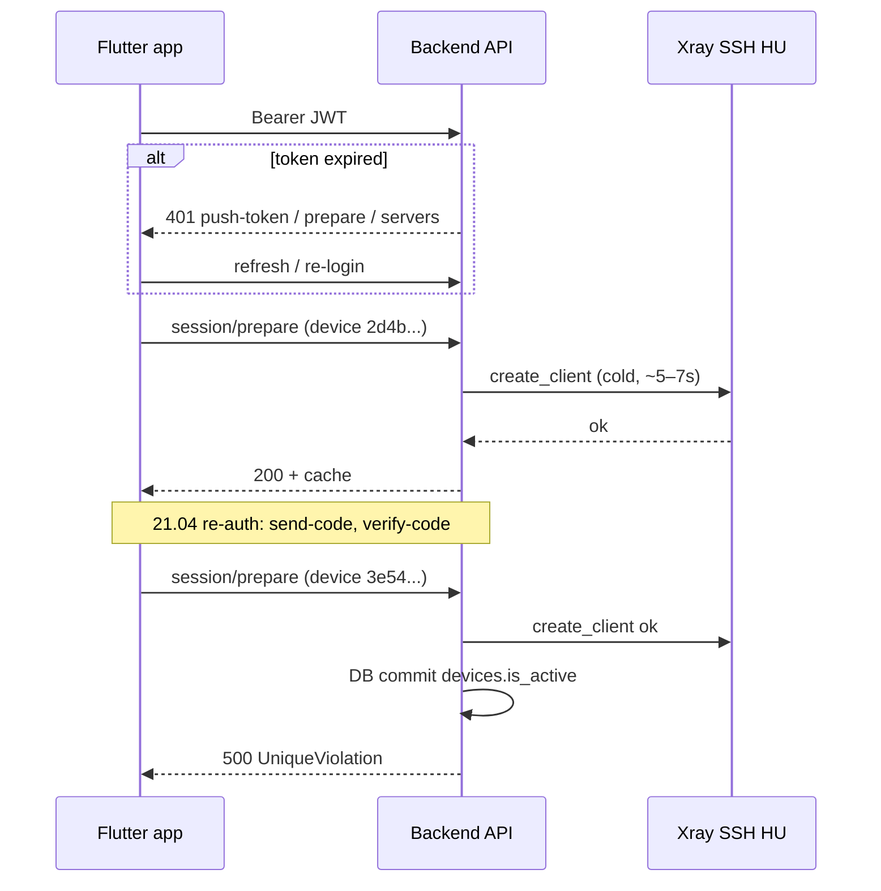

# End-to-end отчёт: rail.tamaew@gmail.com (последние ~24 ч по `grani-backend.log`)

**Источник:** `logs/docker-api/grani-backend.log`  
**Пользователь в БД:** `user_id=1` (по явным строкам с email и по `session_prepare`).  
**Окно:** от последней записи в файле (~**2026-04-21 10:09 UTC**) назад **24 часа** → примерно **2026-04-20 10:10 UTC … 2026-04-21 10:10 UTC**.  
**Часовой пояс в логах:** UTC (суффикс не указан, формат сервера).

**Ограничение:** это только **API-бэкенд**; nginx access за этот день в репозитории не приложен. Клиент → `peer=172.18.0.5` (прокси), клиентский IP иногда в `xff_first` на auth-эндпоинтах.

---

## 1. Идентификация в логах

| Поле | Значение |
|------|----------|
| Email | `rail.tamaew@gmail.com` |
| `user_id` | `1` |
| Основной `device_id` (успешные prepare) | `2d4b603c-a48b-4c71-b8ff-d4d7b56674a5` |
| Проблемный `device_id` (серия 500) | `3e54f374-84a3-4f3a-8d3c-64a482d2ac83` (конфликт с активной записью другого пользователя / глобальный unique) |

---

## 2. Хронология end-to-end (высокий уровень)

### A. Сеть / клиент

- Запросы с **`ua='Dart/3.10 (dart:io)'`** — мобильное приложение.
- Для email-шагов **21.04:** `xff_first=94.180.243.40` (send-code / verify-code).

### B. Жизненный цикл за окно

1. **VPN session prepare** (`POST /api/vpn/session/prepare`, косвенно по `[session_prepare]`): многократно **успешно** с **`device_id=2d4b603c-…`**, **`server_id=1`**, **`xray_vless`**, **`status=200`**.  
   - Холодный путь: **`create_client_ms`** порядка **5–7 с** (SSH/Xray на ноде).  
   - Тёплый путь: **`cache_hit_fast`**, **`elapsed_ms`** единицы миллисекунд.

2. **Просроченный / отсутствующий код** (**21.04 ~09:53 UTC**):  
   - `Код не найден или истек для rail.tamaew@gmail.com`  
   - затем **`send-code`** и **`verify-code`** с тем же email (**успешный** verify по `verify-code-timing`, **28 ms**).

3. **Смена сценария на «чужой» device UUID** (**21.04 ~09:53–09:57**): серия **`session_prepare`** с **`device_id=3e54f374-…`**, все **`status=500`**, внутри — **`UniqueViolation`** на **`ux_devices_device_id_active`** при `commit` после создания Xray-клиента (детали в логах: обновление `devices.id=160`).

4. **Параллельный сбой регистрации устройства** (**21.04 ~06:21**, отдельный `req_id` от session): **`HTTP 400`** на **`/api/vpn/device/register`** — **`NotNullViolation`** в **`client_logs.device_id`** при массовом `UPDATE` (см. stack в логе; связано с `DeviceManager.register_device` / каскадом на `client_logs`).

5. **Истёкший JWT** (несколько раз в окне):  
   - **`401`** на **`/api/vpn/device/push-token`** и на **`/api/vpn/session/prepare`** / **`/api/vpn/servers`** — `token verification failed`; затем успешные запросы с новым токеном (паттерн «сначала 401, потом 200» на **07:51**).

---

## 3. Таблица ключевых событий (сводка по времени)

| UTC время | Событие | Результат | req_id / примечание |
|-----------|---------|-----------|---------------------|
| 2026-04-20 07:55 | `push-token` | **401** неверный токен | `219c16e6-…` |
| 2026-04-20 07:55–07:56 | `session_prepare` | **200**, cold + hot cache | `4dffc7ab-…`, `53c72ffb-…`, device `2d4b603c-…` |
| 2026-04-20 08:01 | `session_prepare` | **200** | `d45968df-…` |
| 2026-04-20 12:29 | token failed (два подряд) | **401** | перед `da8fe8a5-…` |
| 2026-04-20 12:30 | `session_prepare` | **200**, ~6 s create | `da8fe8a5-…` |
| 2026-04-20 12:33 | `session_prepare` ×2 | **200** miss + hit | `0be2a4b1-…`, `a191941d-…` |
| 2026-04-20 13:13 | `session_prepare` | **200**, ~5.2 s | `67658fdd-…` |
| 2026-04-20 14:08 | `push-token` | **401** | `2aebe429-…` |
| 2026-04-20 14:14–14:15 | `session_prepare` ×2 | **200** | `9a1fab8b-…`, `4b53a1c6-…` |
| 2026-04-21 05:33 | `push-token` | **401** | `185de6c8-…` |
| 2026-04-21 05:33 | `session_prepare` | **200**, ~6.9 s | `3e8ff318-…` |
| 2026-04-21 06:21 | `device/register` (параллельно prepare) | **400** client_logs NOT NULL | `4f4cf21e-…` |
| 2026-04-21 06:21 | `session_prepare` | **200**, ~6.4 s | `85261df3-…` |
| 2026-04-21 07:51 | `session_prepare` + servers | **401** затем **200** | `9586917f-…`, `6dca611f-…` |
| 2026-04-21 07:52 | `session_prepare` | **200** cache hit | `78523711-…` |
| 2026-04-21 09:53 | send-code / verify-code | истёкший код → новый вход | `ed4e0e2a-…`, `d94cf989-…`, **94.180.243.40** |
| 2026-04-21 09:53–09:57 | `session_prepare` (много повторов) | **500** UniqueViolation | `c2f80478-…`, `c3572555-…`, `d57aca28-…`, … `e0b59f04-…` |
| 2026-04-21 10:09 | admin / refresh (не пользователь VPN) | 401 / ValidationError | не относится к E2E VPN пользователя |

---

## 4. Диаграмма потока (логическая)

---

## 5. Выводы

1. **Основной «зелёный» путь** за сутки стабилен: **`session_prepare` 200** для **`device_id=2d4b603c-…`**, узкое место по времени — **удалённый `create_client`** (секунды), не API до nginx.

2. **Сбои, видимые в логах:**  
   - **401** — просроченный access-токен (push-token / prepare / servers).  
   - **400** на **`device/register`** — баг данных/ORM с **`client_logs.device_id`**.  
   - **500** на **`session_prepare`** с **`device_id=3e54f374-…`** — конфликт **`ux_devices_device_id_active`** (активная запись с тем же строковым device_id уже есть у другого сценария в БД).

3. **Соответствие «последним суткам»:** после **~10:09 UTC 21.04** в этом файле **нет** новых строк по **`user_id=1`**; если нужна полная суточная выборка «до сейчас», требуется актуальный dump лога с прод-сервера.

---

*Сгенерировано по состоянию репозитория; nginx и биллинг в отчёт не включены (нет данных в workspace).*
