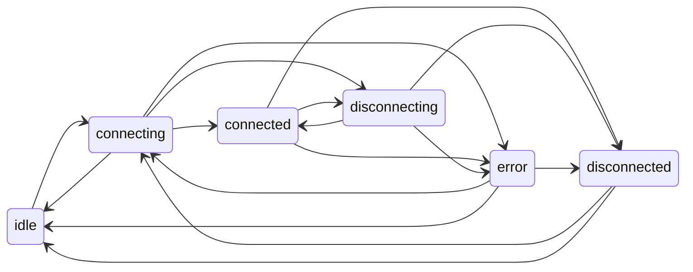

# VPN: явная машина состояний и границы согласованности

## Где код

| Компонент | Файл |
|-----------|------|
| Переходы `VpnConnectionState` + таблица допустимых рёбер | [`lib/core/vpn_state_machine.dart`](../../lib/core/vpn_state_machine.dart) |
| Флаги transport + UI-сессия (`VpnUiSessionState`) | [`lib/services/vpn_service.dart`](../../lib/services/vpn_service.dart) (`_applyTransition`, `vpnUiSessionState`) |
| Этапы пользовательского потока | [`lib/core/vpn/vpn_connection_models.dart`](../../lib/core/vpn/vpn_connection_models.dart) (`ConnectionProgress`) |
| Сценарий cold/warm | `ConnectionFlowType` в том же файле |

## Диаграмма Dart-состояний (transport)

`connected` означает: **прошли verify** и нативный туннель считается поднятым в рамках текущего `connect()`.

## UI-слой (`VpnUiSessionState`)

Отличает «идёт подключение» от «reconnecting», «connected без трафика» (warm) от «есть трафик» (active). Источник: `VpnService.vpnUiSessionState`, не дублировать локальными флагами на экранах.

## Пути без полного Dart-`connect()`

| Источник | Поведение |
|----------|-----------|
| Нативный handover Wi‑Fi↔LTE | `GraniVpnService` перезапускает туннель; Dart может оставаться в `connected`, пока натив жив. Расхождение кратковременно допустимо; при рассинхроне помогает `syncConnectionStateWithNative()` на resume. |
| Quick Tile | Старт из prefs; `connection_session_id` может быть только из prefs/натива — см. logcat `[CORRELATION]`. |
| Процесс убит / задача снята | `onTaskRemoved` рестарт с последним конфигом; Flutter при следующем открытии вызывает restore из натива. |

## Связка с auth

После успешного **refresh access token** `VpnService` получает колбэк и выполняет лёгкую сверку с нативом и сервером (см. `AuthService` + `VpnService._onAuthAccessTokenRefreshed`), чтобы не оставаться с «новым токеном» и устаревшим представлением о сессии VPN.

## Инварианты (кратко)

1. Любое изменение `VpnConnectionState` — через `_applyTransition` (кроме редких guard в колбэках).
2. `connected` в Dart не выставляется до успешного завершения цепочки connect (включая verify), см. комментарии у `_onNativeVpnLinkChanged`.
3. Параллельные `connect()` сходятся в один Future (`_connectFutureGate`).

## Health и reconnect (где уже есть логика)

- **Нативный handover** (Wi‑Fi↔LTE): `GraniVpnService` — debounce сети, cooldown реконнекта, полный рестарт туннеля с MTU (см. код `NET_MONITOR`).
- **Dart** при смене `Connectivity`: отложенный `connect()` с новым MTU (флаги `_reconnectAfterNetworkChange`, `_ignoreNetworkChangeUntil` после resume).
- **Verify** после connect и учёт трафика (`hasEverSeenTraffic`) — критерий «туннель реально несёт данные» для UI warm/active.
- Глобальный **debounce `notifyListeners`** на каждый кадр не включён — риск пропуска валидных переходов; при необходимости точечно на отдельных виджетах.
